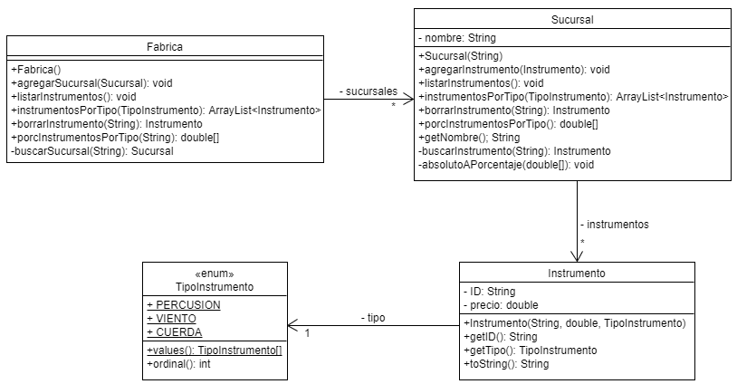

# Colecciones - Actividad 4
🌟 En este ejercicio práctico, trabajaremos con ArrayList en Java ☕ desde el análisis del enunciado 📄 hasta la implementación del código 💻. Aprenderemos a identificar clases a partir de un problema 💡, trasladarlas a un diagrama UML 📊 y luego codificar métodos clave para la manipulación de listas en Java 🧩
## Conceptos Aplicados

* Clases y Objetos
* Estado
* Identidad
* Comportamiento
* Encapsulamiento
* Modificadores de acceso
* Métodos getter/setter
* Palabra `this`
* Constructores
* Método `toString`
* Miembros estáticos
* Enumerados
* Principio “Tell, don’t ask”
* Diagrama de clases UML
* Relaciones de asociación y dependencia
* Listas de objetos con `ArrayList`
* Ciclo For Each
* Uso de iteradores
* Algoritmos con colecciones

## Enunciado

Una fábrica de instrumentos musicales posee una lista con todas sus sucursales. Cada sucursal tiene su nombre y una lista con todos los instrumentos a la venta. De cada uno de ellos se sabe su ID alfanumérico, su precio y su tipo (Percusión, Viento o Cuerda).

## Puntos a desarrollar

1.  Desarrollar el diagrama de clases UML que modele lo enunciado y donde consten las clases con sus atributos, métodos y relaciones (los constructores pueden omitirse).



2.  Crear un proyecto en Java que resuelva:
    
* **A)** La explotación del método `listarInstrumentos` que muestre en la consola todos los datos de cada uno de los instrumentos.
    
```java
public void listarInstrumentos() {
    for (Sucursal sucursal : sucursales) {
        System.out.println(sucursal.getNombre());
        sucursal.listarInstrumentos();
    }
}
```

* **B)** La explotación del método `instrumentosPorTipo` que devuelva una lista de instrumentos cuyo tipo coincida con el recibido por parámetro.

```java
public ArrayList<Instrumento> instrumentosPorTipo(TipoInstrumento tipo) {
    ArrayList<Instrumento> instEncontrados = new ArrayList<>();
    for (Instrumento instrumento : instrumentos) {
        if (instrumento.getTipo() == tipo) {
            instEncontrados.add(instrumento);
        }
    }
    return instEncontrados;
}
```

* **C)** La explotación del método `borrarInstrumento` que reciba un ID y elimine el instrumento asociado a tal ID de la sucursal donde se encuentre.

```java
public Instrumento borrarInstrumento(String ID) {
    Instrumento insABorrar = buscarInstrumento(ID);
    this.instrumentos.remove(insABorrar);
    return insABorrar;
}
```

* **D)** La explotación del método `porcInstrumentosPorTipo` que reciba el nombre de una sucursal y retorne los porcentajes de instrumentos por tipo que hay para tal sucursal.

```java
public double[] porcInstrumentosPorTipo(String nombreSuc) {
    double[] porcentajes = new double[TipoInstrumento.values().length];
    Sucursal sucEncontrada = buscarSucursal(nombreSuc);
    if (sucEncontrada != null) {
        porcentajes = sucEncontrada.porcInstrumentosPorTipo();
    }
    return porcentajes;
}
```
